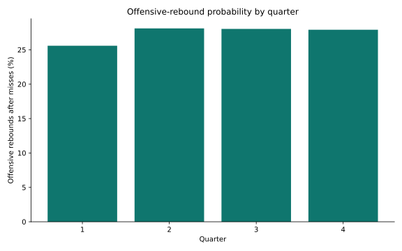

# What Leads to an Offensive Rebound?

Offensive rebounding is one of basketball's most valuable—and comparatively understudied—sources of extra possessions. This project uses NBA play-by-play data to understand which players generate second-chance opportunities and which shot and game contexts make an offensive rebound more likely.

## What the analysis covers

- 539,265 play-by-play events from the 2019–20 NBA season
- 121,284 recorded rebound events, including 36,639 offensive rebounds
- Player-level offensive-rebound production
- Rebound probability after misses at different shot distances
- Rebound probability across regulation quarters

## Selected results


The player ranking excludes team rebounds so the comparison reflects rebounds credited to individual players.


Misses near the basket produced offensive rebounds more frequently than most mid-range and three-point misses. The result supports the idea that rebound location, player positioning, and shot geometry should be studied together rather than treating every miss as the same opportunity.



## Repository structure

```text
analysis/
  prepare_rebounds.py        event linking, summaries, and figure generation
notebooks/
  offensive_rebounding.ipynb exploratory play-by-play work
results/
  figures/                   publication-ready charts
  tables/                    summary data behind each chart
```

## Methods

Missed field goals are linked to the following rebound event within the same game and quarter. The analysis then compares offensive-rebound rates across shot-distance bands and game periods, while separately ranking credited rebounders.

## Tools

Python · pandas · NumPy · Matplotlib · Jupyter
