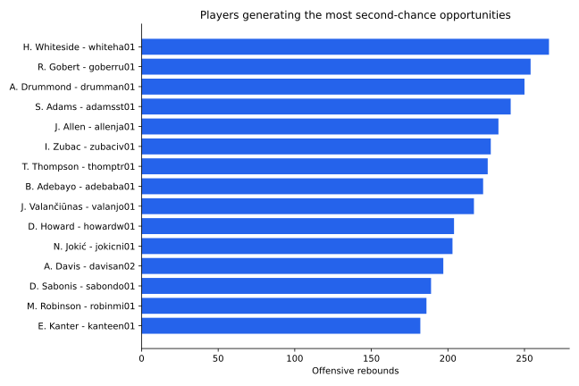
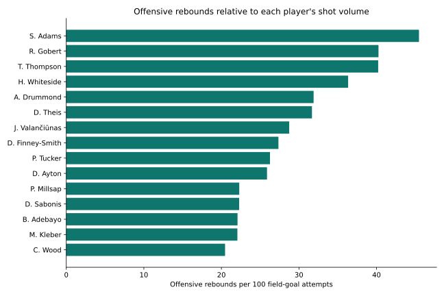
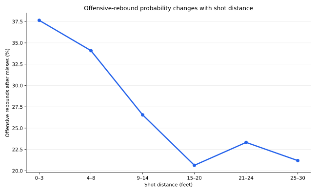

# What Leads to an Offensive Rebound?

Offensive rebounding is one of basketball's most valuable—and comparatively understudied—sources of extra possessions. This project uses NBA play-by-play data to understand which players generate second-chance opportunities and which shot and game contexts make an offensive rebound more likely.

## What the analysis covers

- 539,265 play-by-play events from the 2019–20 NBA season
- 121,284 recorded rebound events, including 36,639 offensive rebounds
- Player-level offensive-rebound production
- Offensive rebounds normalized by each player's shot volume
- Rebound probability after misses at different shot distances

## Selected results



The player ranking excludes team rebounds so the comparison reflects rebounds credited to individual players.



The second view adjusts for how often each player shoots, showing offensive rebounds per 100 field-goal attempts among players with at least 500 attempts. It is an activity-normalized comparison—not a literal conversion rate—because a player can rebound a teammate's miss.



Misses near the basket produced offensive rebounds more frequently than most mid-range and three-point misses. Mid-range attempts are sneaky costly: they return only two points when made, while misses in these distance bands also produced some of the lowest offensive-rebound probabilities in the sample. Shot value and the chance of recovering a miss therefore point in the same direction.

## Repository structure

```text
analysis/
  prepare_rebounds.py        event linking, summaries, and figure generation
notebooks/
  offensive_rebounding.ipynb exploratory play-by-play work
results/
  figures/                   publication-ready charts
  tables/                    summary data behind each chart
```

## Methods

Missed field goals are linked to the following rebound event within the same game segment. The analysis compares offensive-rebound rates across shot-distance bands, ranks credited rebounders, and normalizes player totals by each player's field-goal-attempt volume.

## Tools

Python · pandas · NumPy · Matplotlib · Jupyter
